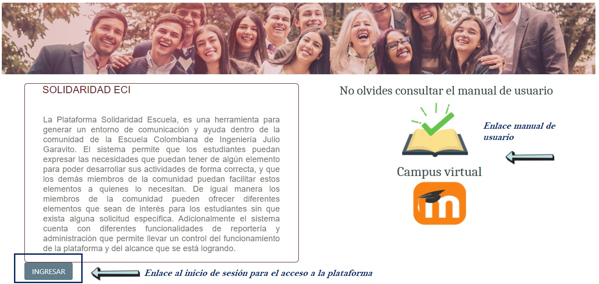
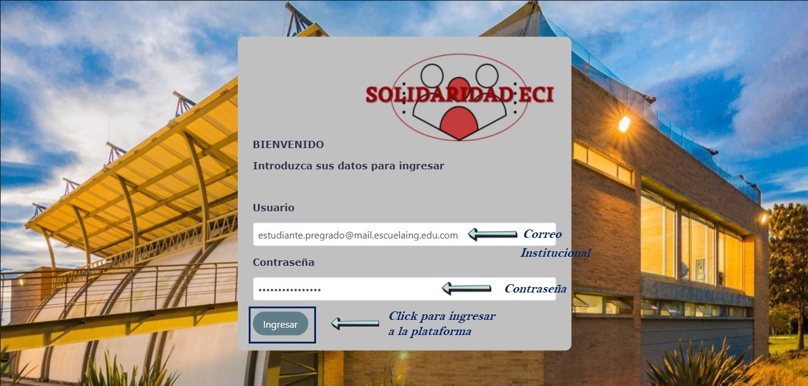
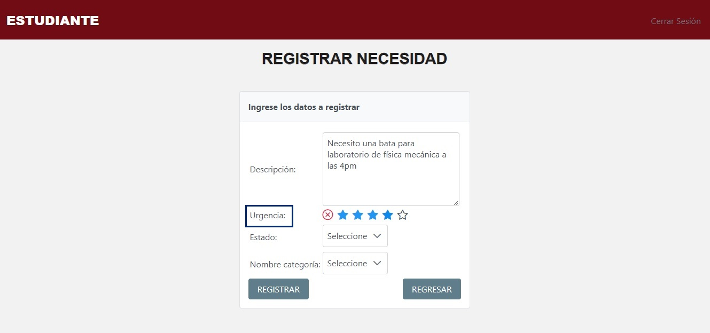
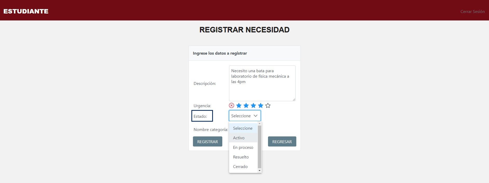
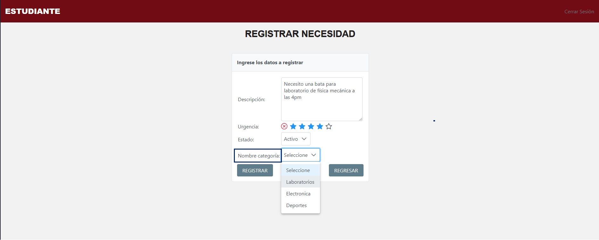
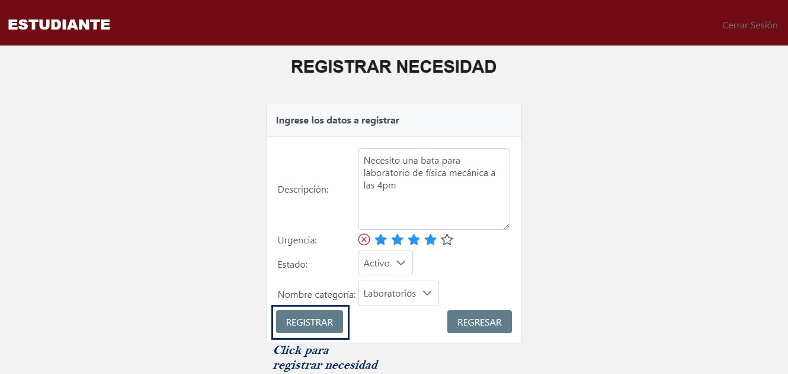
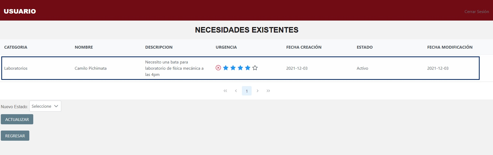
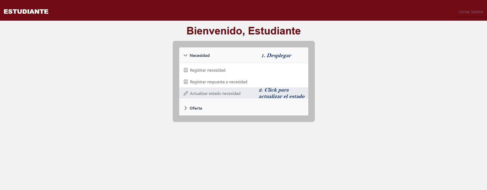
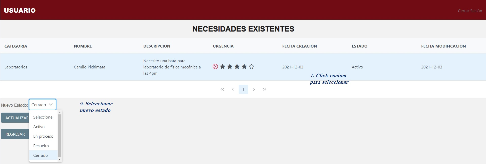
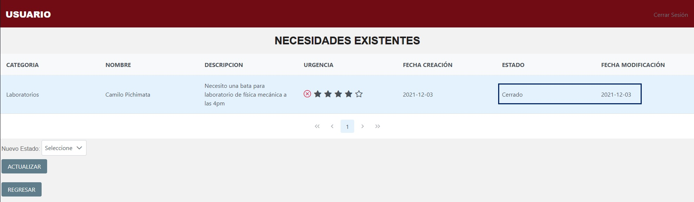

# Plataforma Solidaridad Escuela

## Período académico: 2021-2

## Nombre del curso: Ciclos de Vida del Desarrollo de Software - CVDS

## Nombre del profesor

+   Oscar David Ospina Rodriguez - Product Owner

## Nombres de los integrantes

+   José Manuel Gamboa Gómez - Back
+   Zuly Valentina Vargas Ramírez - Front
+   Cristian Camilo Forero Monroy - UX
+   Camilo Andrés Pichimata Cárdenas - Back

## Descripción del producto

### Descripción General

La **Plataforma Solidaridad Escuela**, es una herramienta para generar un entorno de comunicación y ayuda dentro de la comunidad de la Escuela Colombiana de Ingeniería Julio Garavito. El sistema permite que los estudiantes puedan expresar las necesidades que puedan tener de algún elemento para poder desarrollar sus actividades de forma correcta, y que los demás miembros de la comunidad puedan facilitar estos elementos a quienes lo necesitan. De igual manera los miembros de la comunidad pueden ofrecer diferentes elementos que sean de interés para los estudiantes sin que exista alguna solicitud específica. Adicionalmente el sistema cuenta con diferentes funcionalidades de reportería y administración que permite llevar un control del funcionamiento de la plataforma y del alcance que se está logrando.

### Manual de Usuario

Al ingresar al enlace de la aplicación se muestra la pantalla de inicio. Al lado derecho de esta se encuentra la descripción del proyecto junto al botón que redirecciona al usuario para que pueda 
iniciar sesión. Al lado izquierdo se encuentran los enlaces directos al manual de usuario y a el campus virtual de la universidad. 

Al dar en ingresar se muestra la pantalla de inicio de sesión, en esta se deben ingresar los datos correspondientes. Luego de ingresar los datos se da en ingresar para continuar al menu de usuario con las diferentes opciones. 

Los perfiles de usuario que maneja la plataforma de SOLIDARIDAD ECI son los siguientes:

+   Administrador
+   Administrativo
+   Estudiante
+   Egresado 
+   Profesor 

Según el rol del usuario, se muestran los principales servicios del sistema a las cuales puede acceder. Las principales funcionalidades de la plataforma y los usuarios autorizados para cada una son :

## Registro de Necesidad

**Roles autorizados:** Estudiante.

En el registro de necesidad los usuarios expresan las necesidades que presentan. Para acceder a este servicio debe dirigirse al menú principal, dar click en "Necesidad" y en la opción de "Registrar necesidad".

En la pantalla de Registro Necesidades se debe incluir la siguiente información necesaria. 
En primer lugar se debe agregar una **descripción** de la necesidad en el cuadro de texto extendible. 

Seguido a esto se debe agregar el **nivel de urgencia** de la necesidad, donde 1 es el nivel más bajo y 5 el más alto.

En **Estado** se debe indicar el estado de la necesidad donde se encuentran las opciones de: Activo, En Proceso, Resuelto y Cerrado. 

Por último se debe indicar la categoría a la cual pertenece la necesidad.

Luego de ingresar la información necesaria se debe dar en el botón **Registrar** para ser redirigido a la consulta de necesidades para verificar que esta haya sido registrada. 

Luego de registrar, podemos observar como ha sido guardada la petición recien realizada.

## Actualización Estado de necesidad

**Roles autorizados:** Administrador, Estudiante.

En la actualización del estado de una necesidad se cambia el estado actual de la necesidad deseada. Los estudiantes solo pueden cambiar el estado de las necesidades que registraron mientras que el administrador puede cambiar el estado de las necesidades registradas por los estudiantes. Para acceder a este servicio debe dirigirse al menú principal, dar click en "Necesidad" y en la opción de "Actualizar estado necesidad".

Al dar click en la opción, será redirigido a la ventana de actualización. En esta se debe seleccionar la necesidad que se desea actualizar y seleccionar el nuevo estado de esta.

Para actualizar la necesidad seleccionada se da click en el botón de "Actualizar". Seguido a esto se mostrará actualizada la necesidad con su última fecha de modificación correspondiente.

## Arquitectura y Diseño detallado

### Modelo E-R

### Diagrama de clases

### Descripción de la arquitectura y del Stack de tecnologías utilizado

### Enlace a la aplicación en Heroku

### Enlace al sistema de integración continua

## Descripción del proceso

### Integrantes

### Breve descripción de la Metodología

### Release-burndown chart

### Sprints

#### Sprint 1

Para este primer Sprint definimos 3 historias de usuario: Iniciar sesión, Crear Categoría y Actualizar Categoría. Tuvimos inconvenientes en la implementación y pruebas de Apashe Shiro lo cual era indispensable para lograr satisfactoriamente el inicio de sesión lo que nos impidió terminar a tiempo el Sprint. Sin embargo, se cumplió con la realización correcta de las historias de usuario establecidas.

Historias de usuario:

#### Sprint 2

#### Sprint 3

### Reporte de pruebas y de cubrimiento de las mismas 

### Reporte de análisis estético de código

