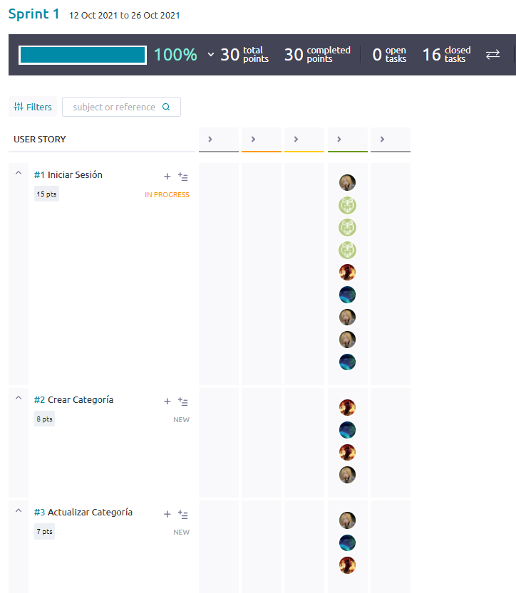
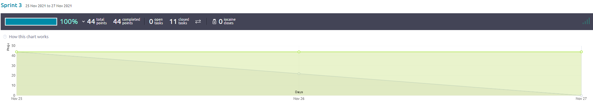

# Plataforma Solidaridad Escuela

## Período académico: 2021-2

## Nombre del curso: Ciclos de Vida del Desarrollo de Software - CVDS

## Nombre del profesor

+   Oscar David Ospina Rodriguez - Product Owner

## Integrantes

+   José Manuel Gamboa Gómez - Back
+   Zuly Valentina Vargas Ramírez - Front
+   Cristian Camilo Forero Monroy - UX
+   Camilo Andrés Pichimata Cárdenas - Back

### Reporte de análisis estético de código

### Enlace a la aplicación en Heroku

### Enlace al sistema de integración continua

## Descripción del producto

### Descripción General

La **Plataforma Solidaridad Escuela**, es una herramienta para generar un entorno de comunicación y ayuda dentro de la comunidad de la Escuela Colombiana de Ingeniería Julio Garavito. El sistema permite que los estudiantes puedan expresar las necesidades que puedan tener de algún elemento para poder desarrollar sus actividades de forma correcta, y que los demás miembros de la comunidad puedan facilitar estos elementos a quienes lo necesitan. De igual manera los miembros de la comunidad pueden ofrecer diferentes elementos que sean de interés para los estudiantes sin que exista alguna solicitud específica. Adicionalmente el sistema cuenta con diferentes funcionalidades de reportería y administración que permite llevar un control del funcionamiento de la plataforma y del alcance que se está logrando.

### Manual de Usuario

Al ingresar al enlace de la aplicación se muestra la pantalla de inicio. Al lado derecho de esta se encuentra la descripción del proyecto junto al botón que redirecciona al usuario para que pueda 
iniciar sesión. Al lado izquierdo se encuentran los enlaces directos al manual de usuario y a el campus virtual de la universidad. 

Al dar en ingresar se muestra la pantalla de inicio de sesión, en esta se deben ingresar los datos correspondientes. Luego de ingresar los datos se da en ingresar para continuar al menu de usuario con las diferentes opciones. 

Los perfiles de usuario que maneja la plataforma de SOLIDARIDAD ECI son los siguientes:

+   Administrador
+   Administrativo
+   Estudiante
+   Egresado 
+   Profesor 

Según el rol del usuario, se muestran los principales servicios del sistema a las cuales puede acceder. Las principales funcionalidades de la plataforma y los usuarios autorizados para cada una son :

## Registro de Necesidad

**Roles autorizados:** Estudiante.

En el registro de necesidad los usuarios expresan las necesidades que presentan. Para acceder a este servicio debe dirigirse al menú principal, dar click en "Necesidad" y en la opción de "Registrar necesidad".

En la pantalla de Registro Necesidades se debe incluir la siguiente información necesaria. 
En primer lugar se debe agregar una **descripción** de la necesidad en el cuadro de texto extendible. 

Seguido a esto se debe agregar el **nivel de urgencia** de la necesidad, donde 1 es el nivel más bajo y 5 el más alto.

En **Estado** se debe indicar el estado de la necesidad donde se encuentran las opciones de: Activo, En Proceso, Resuelto y Cerrado. 

Por último se debe indicar la categoría a la cual pertenece la necesidad.

Luego de ingresar la información necesaria se debe dar en el botón **Registrar** para ser redirigido a la consulta de necesidades para verificar que esta haya sido registrada. 

Luego de registrar, podemos observar como ha sido guardada la petición recien realizada.

## Actualización Estado de necesidad

**Roles autorizados:** Administrador, Estudiante.

En la actualización del estado de una necesidad se cambia el estado actual de la necesidad deseada. Los estudiantes solo pueden cambiar el estado de las necesidades que registraron mientras que el administrador puede cambiar el estado de las necesidades registradas por los estudiantes. Para acceder a este servicio debe dirigirse al menú principal, dar click en "Necesidad" y en la opción de "Actualizar estado necesidad".

Al dar click en la opción, será redirigido a la ventana de actualización. En esta se debe seleccionar la necesidad que se desea actualizar y seleccionar el nuevo estado de esta.

Para actualizar la necesidad seleccionada se da click en el botón de "Actualizar". Seguido a esto se mostrará actualizada la necesidad con su última fecha de modificación correspondiente.

## Dar respuesta a una necesidad

**Roles autorizados:** Administrador, Estudiante, Administrativo, Profesor y Egresado.

En el registro de respuesta a necesidad los usuarios pueden responder a las necesidades activas actualmente. Para esto se debe desplegar el menu en Necesidades y dar en la opción "Registrar respuesta a necesidad ".

Al dar click será redireccionado a la pantalla selección de necesidad a dar respuesta. En esta se selecciona y se da click en "Responder" para continuar.

En la pantalla de registro se debe agregar un comentario de respuesta y dar click en el botón "Registrar" para que sea agregada.

## Registro de Oferta

**Roles autorizados:** Administrador, Estudiante, Administrativo, Profesor y Egresado.

En el registro de oferta los usuarios expresan los diferentes elementos que pueden brindar a la comunidad. Para acceder a este servicio debe dirigirse al menú principal, dar click en "Oferta" y en la opción de "Registrar oferta".

En la pantalla de Registro de Oferta se debe incluir la siguiente información necesaria. 
En primer lugar se debe agregar una **descripción** de la oferta en el cuadro de texto extendible. Al igual que en la necesidad agregamos el **estado** de la OFerta y el **nombre de la categoría** a la cual pertenece. 

Luego de registrar será redireccionado a la consulta de ofertas para verificar que haya sido registrada.

Para actualizar la necesidad seleccionada se despliega el menu en Ofertas y se da click en el botón "Actualizar estado oferta". Seguido a esto se mostrará la lista de ofertas. El Administrador puede cambiar el estado de cualquier oferta, mientras que lo sdemás usuarios solo pueden editar el estado de sus ofertas registradas.

Luego de dar en "Actualizar" se mostrará la respuesta con la actualización del estado.

## Dar respuesta a una Oferta

**Roles autorizados:** Administrador, Estudiante, Administrativo, Profesor y Egresado.

En el registro de respuesta a oferta los usuarios pueden responder a las ofertas activas actualmente. Para esto se debe desplegar el menu en Ofertas y dar en la opción "Registrar respuesta a oferta".
Se mostrarán las ofertas activas existentes, en esta pantalla se debe seleccionar la oferta que se quiere dar respuesta y dar en "Responder".

Al dar click será direccionado al registro de la respuesta, en este debe agregar un comentario y dar uevamente en "Registrar" para guardar la respuesta.

## Registro de categorías

**Roles autorizados:** Administrador.

Para la dministración de las categorias el usuario Administrador es el único autorizado. Para registrar se debe desplegar el menú en "Categorías" y dar click en "Registro de Categoría".

En la pantalla de registro el Administrador debe agregar el nombre de la nueva categoría, descripción y el estado de esta.

## Actualización estado de categoría

**Roles autorizados:** Administrador.

En la actualización de categorías el administrador puede cambiar el nombre de la categoría, agregar una nueva descripción o cambiar el estado.

Luego de actualizar, se muestra la consulta de categorías donde se puede ver la categoría actualizada.

## Eliminación Categoría 

**Roles autorizados:** Administrador.

Para eliminar una categoría el administradir debe desplegar el menú para categoría y seleccionar la opción para eliminar.

Luego de seleccionar la opción será redigirido a la pantalla donde se muestran todas las categorías. En esta el Administrador debe seleccionar la categoría a eliminar y dar en "Eliminar". 

## Reporte de servicios

**Roles autorizados:** Administrador.

La Plataforma le brinda al Administrador el servicio de Reportes de funcionalidades. En este puede ver el reporte categorías, respuestas, necesidades u ofertas.

Para ver los resportes el Administrador debe desplegar la opción de reportes en el menú principal.

## Reporte de necesidades

## Reporte de ofertas

## Reporte de respuestas

## Reporte de categorias

El servicio de reportes incluye la funcionalidad de descarga en .pdf y .xsml. Para esto el administrador debe oprimir el botón correspondiente al formato que prefiere y ya tendrá el reporte correspondiente descargado.

## Arquitectura y Diseño detallado

## Modelo E-R

## Diagrama de clases

### Descripción de la arquitectura y del Stack de tecnologías utilizado

## Capas

+ Aplicación
+ Presentación
+ Persistencia

**Capa de aplicación:** En la capa de aplicación se utilizarón las siguientes tecnologías:

+ Java : Java es una tecnología empleada para el desarrollo de aplicaciones que convierten a la Web en un elemento más interesante y útil. Empleamos este lenguaje de programación para el desarrollo de la plataforma SOLIDARIDAD ECI.

+ Google Guice : Google Guice es un framework que permite la inyección de dependencias.

+ Maven : Maven es una herramienta de software para la gestión y construcción de proyectos. Este fue empleado para la construcción y administración de nuestro proyecto de inicio a fin.

+ Apashe Shiro: Apashe Shiro permite el control de autenticación en aplicaciones. Este fue implementado para el control de autorizaciones y accesos. 

+ JaCoCo: JaCoCo es una herramienta para Java que evalua la cobertura de pruebas. Esta herramienta fue usada para el analisis del cubriento de las pruebas realizadas y la generación del reporte de estas.

**Capa de presentación:**

+ JFS: Java Server Faces es un framework de interfaz de usuario para aplicaciones web en Java. Este fue empleado para la construcción de las interfaces de usuario y su en lace con los beans en la capa de aplicación.

+ Primefaces: Primefaces es una biblioteca de componentes de JSF que brinda diferentes elementos visuales. Fue empleada para el desarrollo de las diferentes pantallas de usuario.

+ CSS: CSS es un lenguaje que permite dar estilo a los archivos html. CSS fue empleado para dar estilo y posicionar visualmente las diferentes interfaces. 

**Capa de persistencia:** 

+ PostgreSQL: Postgrest es un sistema gestor de bases de datos relacionales. Fue usado para la persistencia de la información correspondiente al proyecto.

+ MyBatis: MyBatis es una herramienta de persistencia Java. Este fue empleado para el mapeo de las sentencias SQL.

## Descripción del proceso

### Breve descripción de la Metodología

Para el desarrollo de este proyecto empleamos la metodología SCRUM. Mediante **Taiga** se llevo la administración del proyecto, se manejo el proceso de cada uno de los Sprints y las Historias de Usuario correspondientes, de igual manera se asignaron las tareas a cada usuario según el rol asignado.  

### Release-burndown chart

# Sprints

## Sprint 1

Para este primer Sprint definimos 3 historias de usuario: Iniciar sesión, Crear Categoría y Actualizar Categoría. Tuvimos inconvenientes en la implementación y pruebas de Apashe Shiro lo cual era indispensable para lograr satisfactoriamente el inicio de sesión lo que nos impidió terminar a tiempo el Sprint. Sin embargo, se cumplió con la realización correcta de las historias de usuario establecidas.

Historias de usuario:

## Sprint 2

Para el segundo Sprint definimos 6 historias de usuario: Registrar Necesidad, Registrar Oferta, Registrar Respuesta, Actualizar estado Necesidad, Actualizar estado Oferta y Reporte de necesidades. En este Sprint tuvimos inconvenientes con la base de datos y lo correspondiente a los mapeos lo que nos impidió terminar a tiempo el Sprint, sin embargo se cumplió con la totalidad de las historias de usuario. 

Historias de usuario:

## Sprint 3

Para el tercer y último Sprint definimos 5 historias de usuario: Reporte de ofertas, Reporte de respuestas, Reporte de Categorías más solicitadas/ofrecidas, Eliminar categoria y Gestión de categorías no validas. En este último Sprint tuvimos problemas con lo relacionado a los reportes pero se cumplió totalmente con el Sprint y nos permitió la culminación del proyecto.

Historias de usuario:

### Reporte de pruebas y de cubrimiento de las mismas 